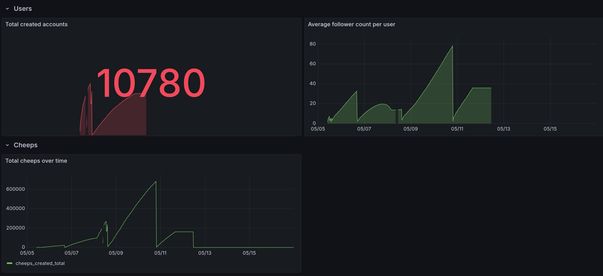
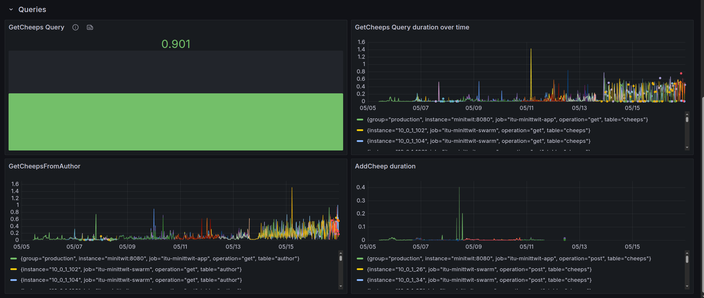
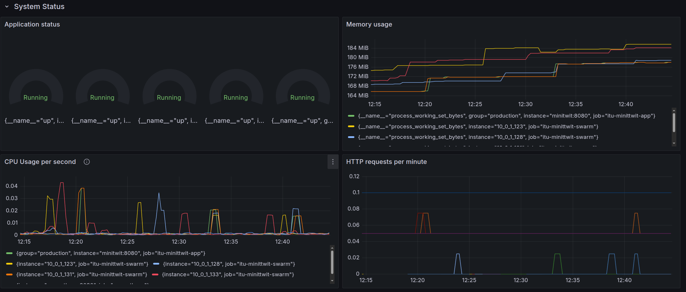

# System's Perspective
This section will give description and illustrations of the design and architecture of our Mini-twit system, dependencies and the current state of out system.

## Design and architecture of our ITU-MiniTwit systems.

# Process Perspective

## CI/CD Pipelines

The CI/CD pipeline consists of three stages. The pipeline can be seen in `/.github/workflows/`. All workflows are run on `ubuntu-24.04`.
A complete illustration can be seen HERE:

### Build and test
The build and test workflow is run on `push` to main and on `pull-requests` and consists of the following steps that run in parrallel:
1. **Code linter with Csharpier**: Checks the format of the code and reports. Does not automaticly apply the format.
2. **Dockerfile linter with Hadolint**: Checks the format of the Minitwit dockerfile.  <-- WE SHOULD LINT MORE THAN ONLY THIS?
3. **Build the application**: Builds the applications and runs test:
- Runs unit and intergreation test
- Runs test on the API / simulator endpoint.
- Runs E2E / Playwright tests

### CI/CD 
The CI/CD workflow runs on a succesfull Build and Test workflow and push to main. It consists of the following steps that run sequentially:
1. **Dockerhub - CI**:
- Builds and pushes the `Minitwit`, `Grafana`, `Alloy`, `Loki` and `Promethues` docker images to Dockerhub.
2. **SSH and Deploy - CD**
- SSH into the node named leader in the swarm.
- Copy the stack file `/itu-minitwit/infrastructure/docker_swarm/stack/minitwit_stack.yml` to the node.
- Deploy to the swarm.

### Release
The release workflow runs on a successfull CI/CD run. 
It builds and zips the application for Windows, Mac and Linux.

### SonarQube

## Monitoring
Monitoring is done on a business level, application level, and infrastructure level. 

### Business Monitoring
On a business level we monitor:
- Number of created accounts
- Average follower count per user
- Total cheeps over time

### Application monitoring
On a application level we monitor different database queries that MiniTwit makes:
- GetCheeps query durations
- GetCheepsFromAuthor
- AddCheep

### Infrastructure level
On a infrastructure level we monitor:
- The status of nodes
- Memory usage of nodes
- CPU usage of nodes
- HTTP per minutte for each node'

## Logging
(HUSK AT ÆNDRE URL TIL LOGGING)

## Security hardening

## Availability and scaling

### Availability

**SPOF**
Docker swarm cluster, 5 nodes

### Scaling
The application can be scaled in two different ways:  
**Vertical scaling**: A single node can be scaled vertically either by rezising the node in DigitalOcean or changing the `size` field in `minitwit_swarm_cluster.tf` and applying it with terraform.  
**Horizontal scaling**: The deployment of the application can be scaled horizontal by increasing the amount of nodes in the cluster. This can be done by increasing the `count` number of e.g. a Worker node and then make it join the swarm (det skal vi lige tjekke op på). 

# Reflection Perspective
## Biggest issues
### Migrating Database
The migration from the sqlite database to postgres database on DigitalOcean gave us troube, when moving the old data to the new database, as the format of sqlite and postgres did not match. We solved this by converting the sqlite dump to csv-files, which could then be converted into posgres dumps in the correct format. 

### Logging
Logging has been a consitant issue. Logs would "dissapear" after a while using Grafana log drilldown, only showing logs for one or two of out entities. We instead made a log dashboard, like the minitwit dashboard, fixing the problem. 

### Terraform
Terraform

## Learned lessons
### Test-server
Having a test-server would have been benefitial for this project, as we currently only have our "main" server. This would have allowed us to further test new features or fixes, before they ended up in production.

### Importance of good logging
Having more indept logging, would have made it easier to spot errors in our program. We often had to check the logs on the server, by ssh into it, instead of using the grafana dashboard. Having more logs show up in grafana, for example queries to the database, could have given us more information about the more niche parts of our program.   

# Use of Generative AI
Generative AI has been used to help solve issues with debugging errors and helped with parts of the coding. Used Ais are ChatGPT and Claude AI. They have been co-aurthored when they have been used, often with a small message, explaining what they did.
They have helped us get a better understanding of how our code works and potential errors that can occur. Obviously, there is a possibility of loss of learning opportunities, as AI speeds up the problemsolving process, sometimes highlighting issues we had not observed yet.     